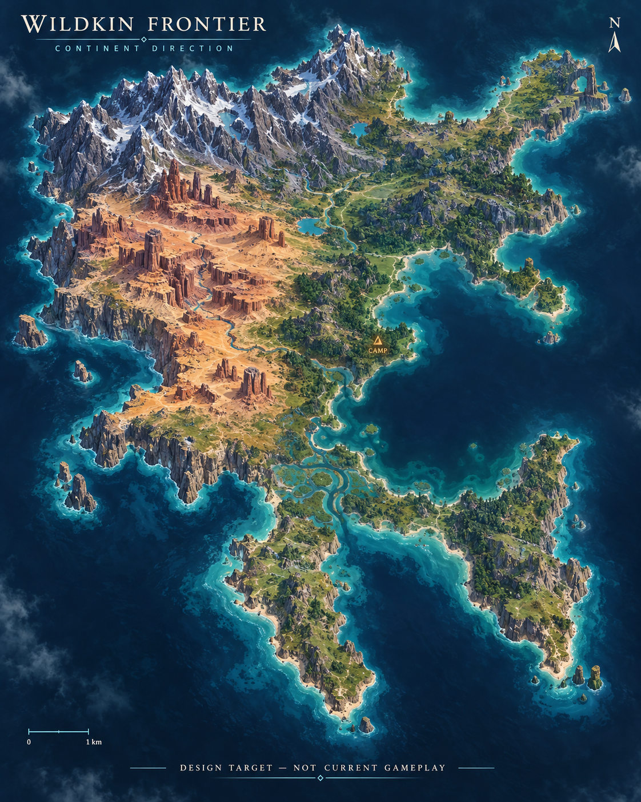
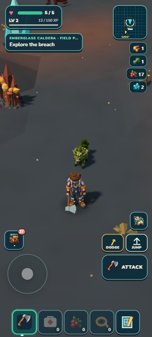
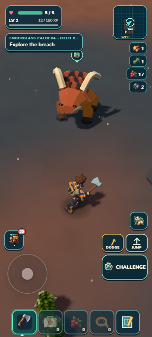

# Living Frontier research refresh

Latest local evidence: [ten fixed habitat areas](../../../art/reviews/finite-habitats/receipt.md), with a paired actual-terrain/allocation map and native portrait screenshots. Ten completed habitat experiences remain in production. Earlier Drive PDFs remain dated publications; this local update has not been uploaded.

**Latest local continent update:** [Illustrated progress](Early-Alpha-Progress.md) pairs the generated target with the actual 6 × 7 km outline, native shore screenshots and preserved portable Camp. It records exploration-first priorities, ten unique early-alpha habitats and the later physical factory direction. Earlier Drive PDFs remain dated publications.

**New direction, not yet implemented:** ten unique habitats are now an early-alpha requirement, on a larger irregular continent. [The frozen target and hybrid implementation plan](../../CONTINENT_ALPHA_TARGET.md) distinguish proposed geography from current source.

September13,2026: repository-owned research, implementation evidence and owner direction.

**Newest scenery preparation checkpoint:** [Illustrated progress](Early-Alpha-Progress.md) includes actual travel/Camp screenshots,270.5→16.6ms scenery crossing work,420.6→161ms slowest frame, all1,350 tests and exact developer/portable saved continuation. Density is unchanged; source PASS, prior visual6.8HOLD and residual loading hitches remain explicit. This local supplement does not update prior Drive/PDF publication.

**Prior connected outing:** [Early-alpha illustrated progress](Early-Alpha-Progress.md) now opens with the earned Camp-to-grove outing: corrected garden focus, established-away guidance, ordinary-input travel and the collected Mossling cache. [The current receipt](../../../art/reviews/alpha-preview/receipt.md) discloses read-only route guidance and records physical return, the next garden use, all 1,322 checks and complete developer/portable save parity. It also records the next provisional visual question—readable Sunscar/Lush ecotone travel within existing grass, scenery and caps—without promising more assets or new biomes. The [early-alpha plan](../../EARLY_ALPHA_PLAN.md) keeps the roughly10-habitat/30-species direction staged and the danger, physical-mobile and distribution limits explicit. These local supplements are newer than the dated PDFs below.

Later local checkpoints, September13: [terrain preparation and scenery reuse](../../../art/reviews/streaming-preparation/receipt.md) records the current timing chart, portable screenshot, bounded ownership and validation. The preceding [Signal Cache receipt](../../../art/reviews/frontier-discoveries/receipt.md) adds actual approach/opened-chest screenshots and one-time reward proof. These follow the separately delivered PDFs below; those Drive files still represent their recorded publication checkpoint.

- [Visual Fieldbook](Living-Frontier-Visual-Fieldbook.pdf): portrait pages with actual game screenshots, proposed mockups, process diagrams and an exploration-area graph.
- [Detailed Research Appendix](Living-Frontier-Research-Appendix.pdf) and [editable Markdown](Living-Frontier-Research-Appendix.md): current-state ledger, world generation, modular creatures, reproduction, habitat research, aging/DNA choices, community and sources.
- [Image manifest](image-manifest.md): exact sources and current/proposed distinctions. Game art targets are not game screenshots.
- [Build and evidence metadata](review/qa.json): final page counts, dimensions, sizes and hashes. Numbered contact sheets are rendered from the same PDFs.

The portable image copies live in `images/actual/` and `images/concept/`. The reproducible builder is [build_living_frontier_report.py](../../../tools/research/build_living_frontier_report.py); it uses ReportLab, Pillow, pypdf and pypdfium2 from the existing document runtime. The appendix PDF renders the Markdown source. The fieldbook's short captions and page arrangements are editable in the builder.

Original morning research remains preserved outside the repo at `C:/Users/cwood/Documents/Wildkin-Research/2026-09-12/`.

Existing phone links: [Google Drive Visual Fieldbook](https://drive.google.com/file/d/1CxksdXis14pKQ_3KyKvUHKMLhNly8D5y/view) and [Google Drive Detailed Appendix](https://drive.google.com/file/d/14Hbboycp5oFvID5TwbVpPR2uA_uvJph5/view). Delivery verification belongs in `delivery-receipt.json` after the authorized update succeeds; a link alone does not prove synchronization.

## Caldera working candidate — September13

Caldera now has volcanic terrain, finite crystal/iron and a territorial Emberhorn outing. Normal controls proved gathering, warning/retreat, streamed depletion and exact developer/portable continuation. **1,378 tests and package gates pass** (44.36 MB unpacked /20.59 MB ZIP). Visual R3 remains **HOLD 3.8/10**; ten allocated habitats are still not ten finished habitats. [Illustrated local report](../../../art/reviews/caldera/receipt.md).

 

Exploration leads; collecting and satisfying base/factory construction are overlapping motivations. The next priority is a more useful portrait exploration view. These newer local artifacts have not replaced the earlier dated Drive PDFs.
