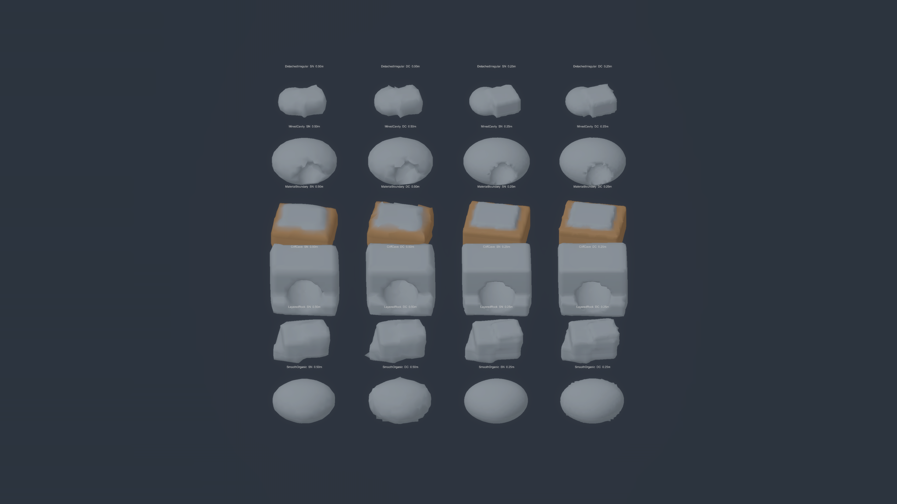
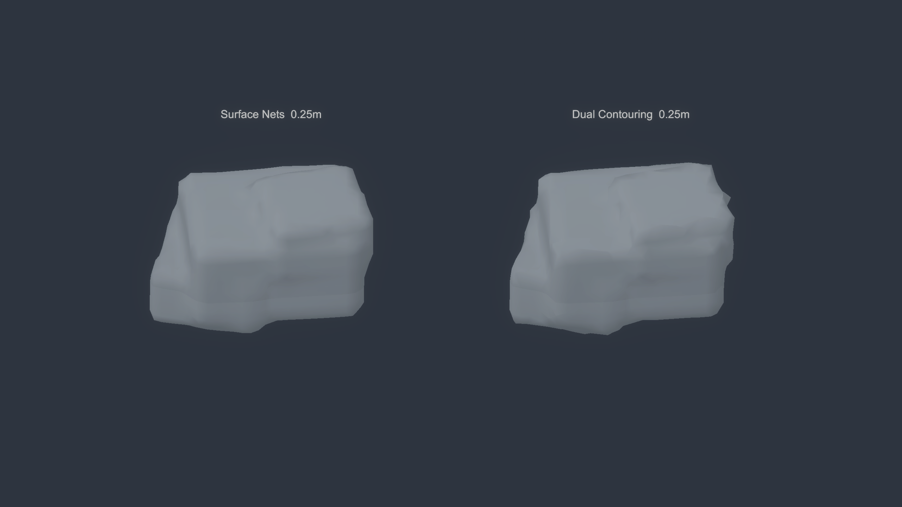
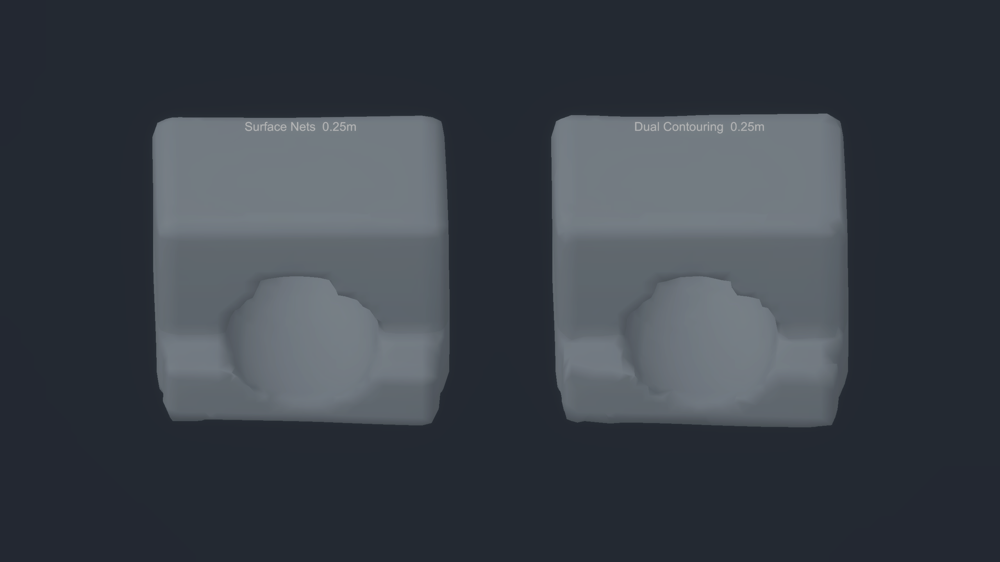
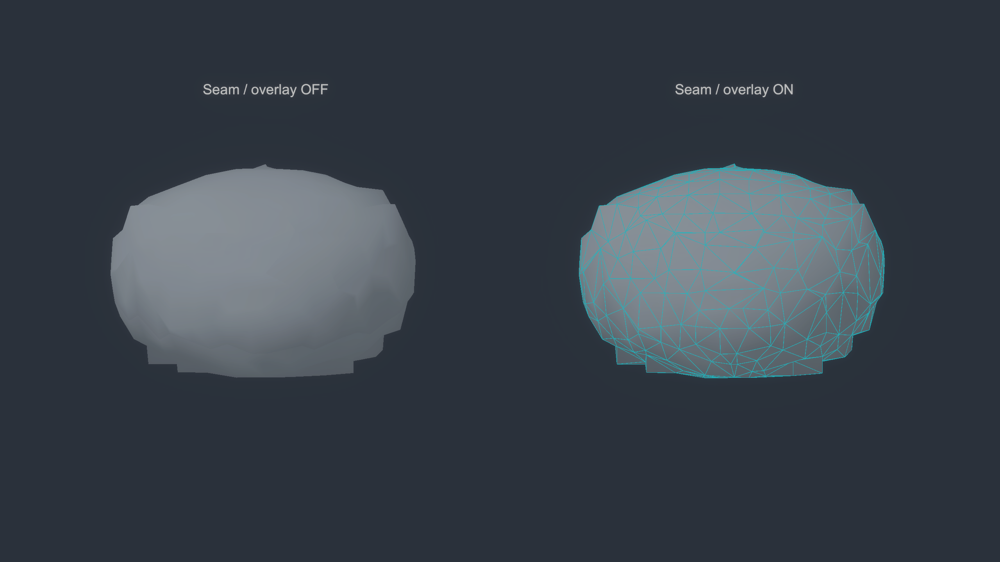
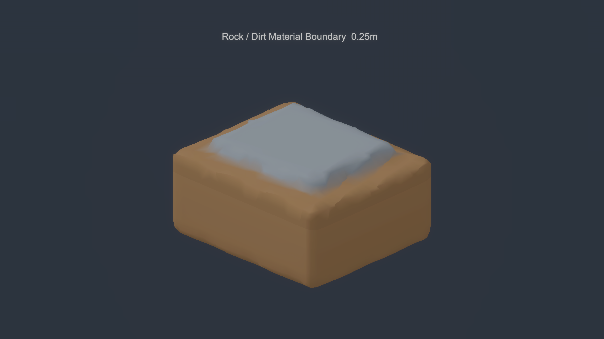
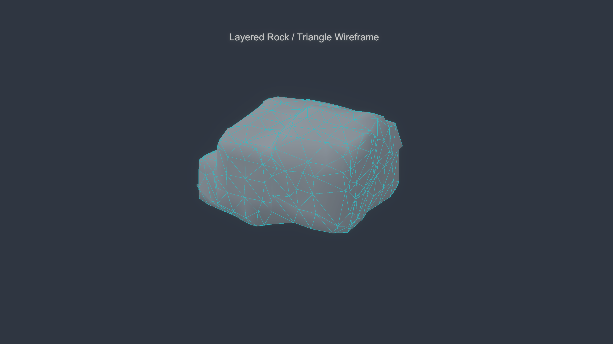
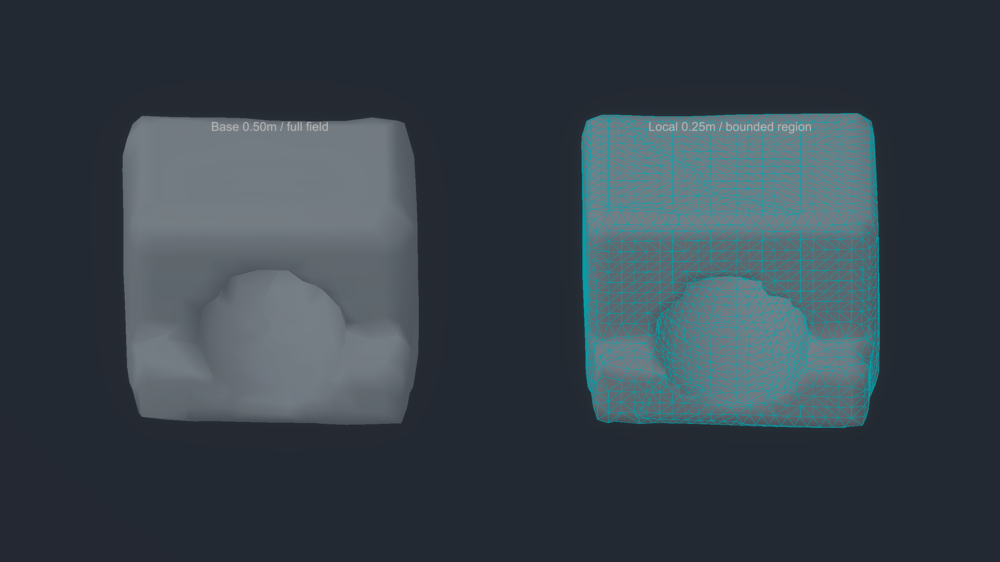
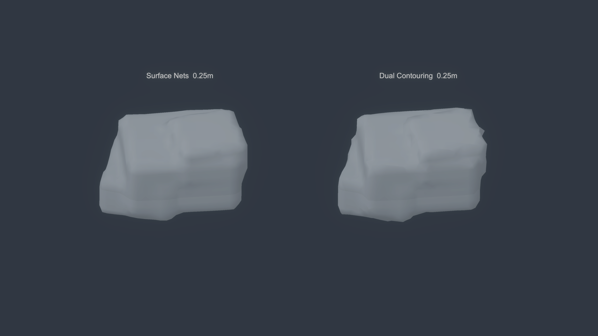

# U3 — Mesher and Resolution Bakeoff

**Implementation evidence is assembled; status is HOLD pending the independent root review.** This does not admit U3 and does not authorize U4. The runtime comparison uses one frozen fixture source, the same global matter authority, the same camera/material framing, and actual mesh generation/publication paths. The provisional recommendations are exactly `SURFACE_NETS` and `LOCAL_REFINEMENT_DIRECTION`.

## Scope and environment

- Unity `6000.3.25f1`, HDRP `17.3.0`, Windows Editor; Unity CLI `1.0.0-beta.11`, Pipeline `0.8.0-exp.1`.
- No direct Unity MCP was exposed. The live CLI/Pipeline bridge drove scene setup, tests, benchmark, build and captures. No Unity/HDRP/CLI/Pipeline/plugin upgrade or package install was made.
- Seed `20260927`, fixture source version `1`; six frozen fields feed both independent meshers: SmoothOrganic, LayeredRock, CliffCave, MaterialBoundary, MinedCavity and DetachedIrregular. Exact formulas/parameters are in `receipt.json` and `Assets/Wildkin/Matter/Core/MatterFixtures.cs`.
- Samples have one global owner in half-open 16³-sample bricks. Each 16³-cell mesh region reads an 18³ scalar window: the required 17³ corners plus a one-sample negative edge-owner halo. No duplicate brick-owned matter or edit state was introduced.
- The actual comparison scene is `Assets/Wildkin/Scenes/Tech/U3MesherResolution.unity`. Agent commands select fixture/mesher/resolution, regenerate and report meshes, create matched views, capture PNGs, run the full benchmark matrix, and build a Windows Development player.

## Visual evidence

The primary board contains all 24 fixture × mesher × uniform-resolution cases at matched camera framing, colors and light. Additional captures isolate the authored layered form, cliff/cave, chunk seam with debug overlay off/on, rock/dirt boundary, triangle topology, and local-refinement direction. The visible Windows Development player capture reproduces the runtime matter path.

## Meshers and seam proof

Surface Nets places one dual vertex at the mean of Hermite edge intersections. Dual Contouring is a separate implementation: it builds edge intersections and finite-difference gradients, solves a regularized least-squares QEF, clamps the result to its cell and falls back deterministically to the Hermite centroid for numerical/rank failures. The shape fixtures include planes, rounded corners, shelves, creases, caves and a material boundary. Mesh positions, source/rest positions, normals, rock/dirt weights, indices and hashes are deterministic and generated by engine-light code.

The 23 dedicated mesher tests plus the Burst-readiness probe are represented in the 67/67 EditMode XML. They cover repeat hashes, finite values/indices, deterministic materials, six-field matrix generation, distinct SN/DC topology, QEF fallback/clamping and planar behavior, shared global samples, 2×2 same-resolution brick seams, and edit/remesh revision changes with no stale mesh. The PlayMode smoke is 1/1. Both meshers publish via writable MeshData. `seam-overlay-off-on.png` shows four independently generated adjacent regions; no visible same-resolution crack or overlap was observed in the matched camera view. This is not proof of mixed-resolution stitching.

## Benchmarks

`benchmark-matrix-editor.json` records every one of six fixtures × two meshers × two spacings, over the same 16m³ domain. Each row uses one unmeasured warm-up and five measured rebuilds. It separates scalar snapshot, pure generation, MeshData fill, apply, upload and total rebuild, with median and nearest-rank p95; for five runs p95 is the largest observed run. Figures below average the six fixture medians; p95 shows the maximum row p95 across those fixtures.

| Mesher | Spacing | Regions | Source authority bricks | Scalar samples / raw snapshot | Vertices / triangles (sum of six fixtures) | Snapshot median | Pure mesher median | Total rebuild median | Max row total p95 |
|---|---:|---:|---:|---:|---:|---:|---:|---:|---:|
| Surface Nets | 0.50m | 8 | 64 | 46,656 / 233,280 B | 3,149 / 4,668 | 137.1 ms | 98.0 ms | 235.9 ms | 297.9 ms |
| Dual Contouring | 0.50m | 8 | 64 | 46,656 / 233,280 B | 3,149 / 4,665 | 134.2 ms | 97.5 ms | 233.4 ms | 301.9 ms |
| Surface Nets | 0.25m | 64 | 216 | 373,248 / 1,866,240 B | 10,991 / 18,964 | 538.2 ms | 776.8 ms | 1,319.6 ms | 1,574.4 ms |
| Dual Contouring | 0.25m | 64 | 216 | 373,248 / 1,866,240 B | 10,991 / 18,958 | 531.8 ms | 769.4 ms | 1,304.2 ms | 1,484.5 ms |

Uniform 0.25m uses 8× the scalar samples/raw snapshot and about 3.5× the vertices and 4× the triangles, while the six-fixture average total rebuild median is about 5.6× the 0.50m result. Managed allocation bytes are **unavailable**, not zero: the installed `GC.GetAllocatedBytesForCurrentThread` probe did not increase for a known 1 KiB allocation. The JSON records `-1` as an unavailable sentinel and retains generation-collection counts.

### Jobs/Burst readiness

`burst-readiness-editor.json` is a test-only Burst-enabled `IJobParallelFor` probe over the LayeredRock 0.25m, 16m³ domain: active-cell sign classification for 314,432 cells. It matched the scalar result across all cells. With input generation/copy and NativeArray allocation outside the timed interval, the scalar median was 14.64ms and job schedule+complete median 0.94ms (15.5× for this classification kernel; p95 25.56ms vs 1.06ms). This does **not** measure full meshing or justify an end-to-end speedup claim. Runtime mesher code remains engine-light; the probe leaves package references test-only and adds no manifest dependency.

## Resolution and recommendation

The .25m hero samples show crisper small shelves/corners in places, but the difference between the honest DC QEF surface and Surface Nets centroid surface is modest for these authored forms. DC did not show a material runtime advantage in the matched matrix; its fallback/clamp counts are substantial on noisy and sharply featured fields. The provisional choice is therefore `SURFACE_NETS` as the simpler default, pending root image review.

Uniform 0.25m is not justified as a blanket world setting by this cost/detail trade. The local-refinement direction compares a 16m³ 0.50m base with an isolated 8m³ bounded 0.25m detail sample and shows denser geometry at the higher detail scale. It deliberately does **not** stitch the finer sample into the base, and its boundary is not claimed crack-free. The provisional resolution recommendation is `LOCAL_REFINEMENT_DIRECTION`, with crack-free transitions left as a named downstream risk.

## Validation and build

- Final Unity EditMode: **67/67 passed**; XML: `all-editmode.xml`.
- Final Unity PlayMode: **1/1 passed**; XML: `all-playmode.xml`.
- Focused U3 mesher tests: **23/23 passed**; `focused-editmode.xml`.
- Windows x64 Development Build: succeeded, 0 errors, 2 warning categories; provenance in `build-provenance.json`. The build output is in task-specific `%LOCALAPPDATA%\Temp\wildkin-u3-mesher-resolution\` and is not committed.
- Player observation: visible player launch and auto-quit succeeded and produced `player-observation.png`/JSON. A preceding hidden-window capture failed to create a screenshot; it was not used as evidence.

## Tool notes and limits

- CLI `run_tests` printed `0/0` while an Editor assembly reload was in progress; `test_status` then returned the actual run result. One status query briefly could not connect during domain reload. The final tests and XML are current and green.
- An early custom vertex shader import had a compile error, then a first color layout mapped the wrong vertex attributes and produced rainbow colors. The shader/layout were corrected; all submitted captures use the final flat stylized normal-key/ambient ramp. The earlier failed images were discarded.
- Editor HDRP/Lit captures washed the forms out, so the final comparison uses an internally authored HDRP-compatible vertex-color shader with fixed face lighting and subtle height/material tints. The matched camera, scale, light and material treatment is shared across all mesher/resolution cases.
- Mixed-resolution transitions, streaming-scale memory/budgeting, colliders/physics, edits at refined seams, production art approval, player performance beyond this single observation, and renderer/material production integration remain out of scope. Root must inspect the images and implementation before U3 can be marked PASS. U4 has not started.
