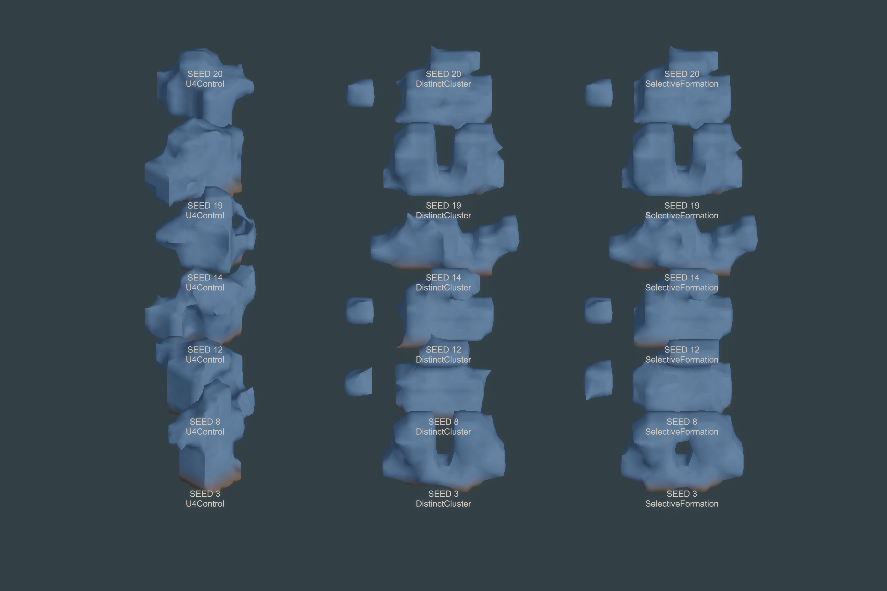
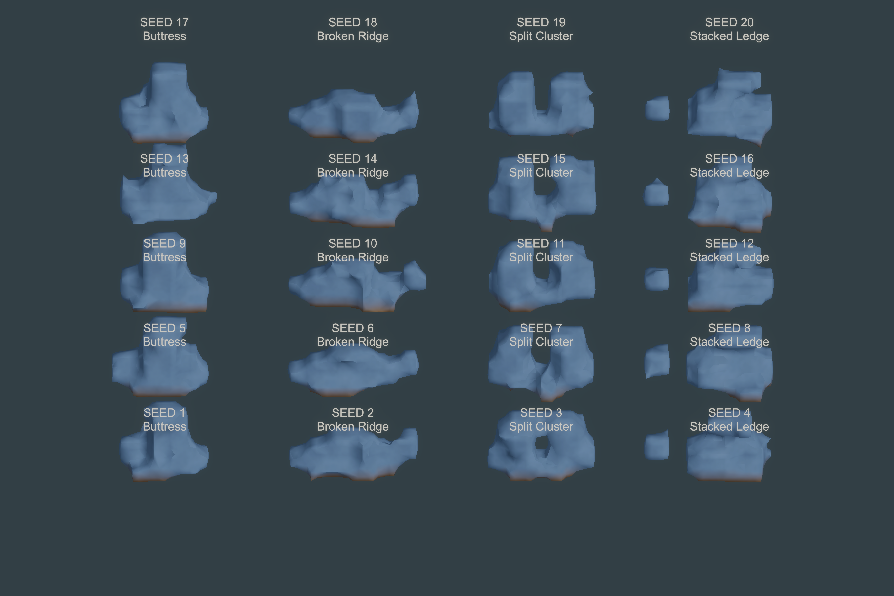
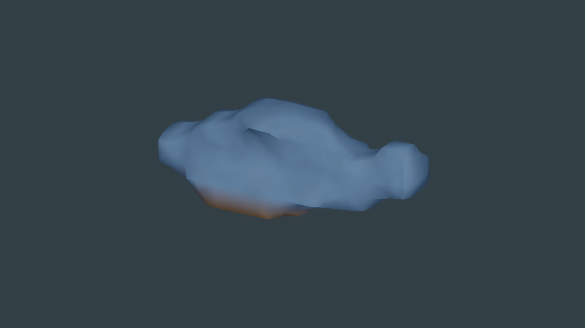
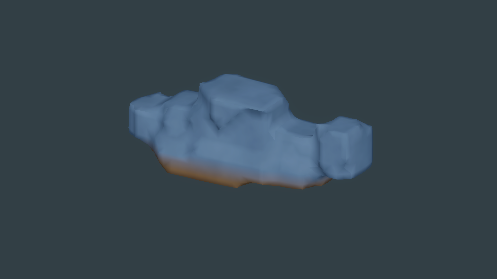

# U4B procedural rock formation construction

**Disposition: HOLD after independent review, September 27, 2026.** This is a new construction-method experiment; it does not replace the historical U4 result. U4 remains a valid visual HOLD. U4B preserves the U2 matter authority, Surface Nets, and the 0.50 m default, and does not start U5 destruction or Unreal work.

## Result

The experiment compares the unchanged U4 control, hard distinct-stone clusters, and a selective formation that blends only its central group. `SelectiveFormation` is the provisional technical choice: the 0.40 m core blend gives a more continuous center than `DistinctCluster` while capstones and accents remain hard-separated. The six matched cases use the same lighting, camera, scale, and material. The visual gain over U4 is too modest to pass the authored-rock target.

The final gallery contains 20 deterministic formations: five each of Buttress, Broken Ridge, Split Cluster, and Stacked Ledge. It has zero rejected final seeds (four bounded attempts were rejected and regenerated). Fifteen results resolve to one component; the five Stacked Ledges resolve to two substantial components, with 18–26 samples in the smaller accent and a 0.5 m bounds gap. Independent review found the family still reads as soft, fused SDF clasts, with little silhouette change within each archetype and weak material separation. Seed 6, the smallest accepted 0.50 m example, remains a generic fused ridge. U4B is therefore **HOLD for visual quality and procedural variation**.





## Construction and matter results

Each formation is composed from deterministic convex, clipped stone recipes with explicit roles. The recipes are generation metadata only. Resolution writes ordinary sparse samples into an all-air-backed version-2 `MatterWorld`; the runtime matter authority does not retain source stones. Seed 4 at 0.50 m records 212 authoritative sparse edits and two components of 192 and 20 samples. The old one-component art rule is intentionally replaced by bounded component diagnostics and validation.

The shared rock/dirt surface remains one submesh with material weights. The seam capture shows no visible crack, and the existing translation/rotation projection test passes. The projection pair is code/test-backed; the visual signal is weak because this material has little readable texture character. The component overlay is a diagnostic, not a player-facing outline.

The seed-6 0.25 m check now passes the same physical bounds as 0.50 m after changing validation from sample-count limits to meter limits. Both resolutions use the same first-attempt recipe and camera/material:

| Spacing | Occupied samples | Vertices | Triangles | Resolve (ms) | Surface Nets (ms) |
| --- | ---: | ---: | ---: | ---: | ---: |
| 0.50 m | 168 | 322 | 458 | 24.64 | 89.64 |
| 0.25 m | 1,292 | 1,163 | 1,872 | 118.50 | 53.86 |

The 0.25 m view shows sharper planes, but does not change the fused-clast read. These are individual Editor measurements, not a performance benchmark. No GPU timing is available; the player frame observation is only a launch/render capture check.





## Validation and build

- Focused U4B EditMode suite: 7/7 passed.
- Full EditMode suite: 82/82 passed.
- PlayMode suite: 1/1 passed.
- Windows x64 Development Player: succeeded with 0 errors and 2 warnings; 12.23 seconds reported by Unity; total build size 230,137,170 bytes. The player exited 0 and captured the 20-seed gallery.
- Independent read-only review: HOLD for repeated within-family silhouettes, soft fused forms, and weak material separation. Matter authority, multiple components, corrected resolution validation, tests, and build were accepted.

The per-seed Editor observations span 0.03–0.16 ms generation, 17.47–77.11 ms scalar resolution, 21.91–27.35 ms snapshot, 47.48–65.06 ms Surface Nets, 319–455 vertices, and 452–672 triangles. The raw payload estimate excludes managed dictionary, mesh-driver, texture, and renderer overhead. These numbers do not establish player performance.

## Reproduction

The existing Unity CLI/Pipeline bridge (`0.8.0-exp.1`) reproduces the evidence without Inspector parameter edits:

```powershell
unity command --project-path 'native\unity\WildkinUnity' generate_construction_comparison --seed_set '3,8,12,14,19,20'
unity command --project-path 'native\unity\WildkinUnity' generate_formation_gallery --seed_start 1 --count 20 --construction_mode SelectiveFormation
unity command --project-path 'native\unity\WildkinUnity' inspect_rock_formation --seed 6 --archetype 'Broken Ridge' --construction_mode SelectiveFormation --resolution 0.25
unity command --project-path 'native\unity\WildkinUnity' u4b_build_windows_development --output '<temporary Windows build path>'
```

## Evidence index

- `matched-construction-comparison.png` and `matched-construction-comparison-metrics.json` — six seeds in all three modes.
- `final-20-seed-gallery.png` and `final-20-seed-gallery-metrics.json` — selected method and per-seed recipe, component, mesh, and timing metrics.
- `hero-seed01` through `hero-seed04`, plus `weakest-seed06` — beauty, second angle, and wireframe captures with metrics sidecars.
- `component-contact-debug.png`, `seam-seed14-shared-rock-dirt.png`, and `projection-before.png` / `projection-after.png` — component, shared-surface, and transform evidence.
- `weakest-seed06-broken-ridge-050m.png` and `weakest-seed06-broken-ridge-025m.png` — matched resolution diagnostic; `matter-authority-seed06-025m.json` records first-attempt acceptance.
- `editmode-focused.xml`, `editmode-full.xml`, `playmode-full.xml`, `build-provenance.json`, `windows-player-observation.png`, and `windows-player-metrics.json` — test, build, and player evidence.
- `receipt.json` — machine-readable result summary.

The resolution correction is covered by `QuarterMeterResolution_UsesTheSamePhysicalBoundsAsHalfMeterResolution`; the 20-seed deterministic test also now requires successful validation. U5 support/contact graphs remain a future design note only. The result does not qualify Unity for production and does not authorize U5 or a second-engine comparison.
