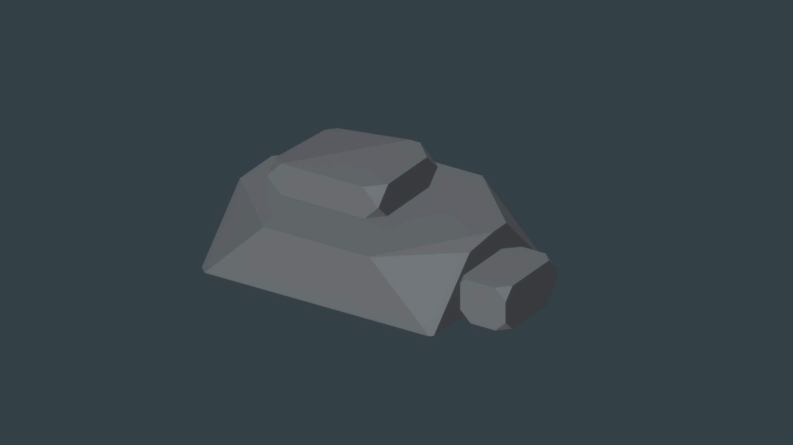
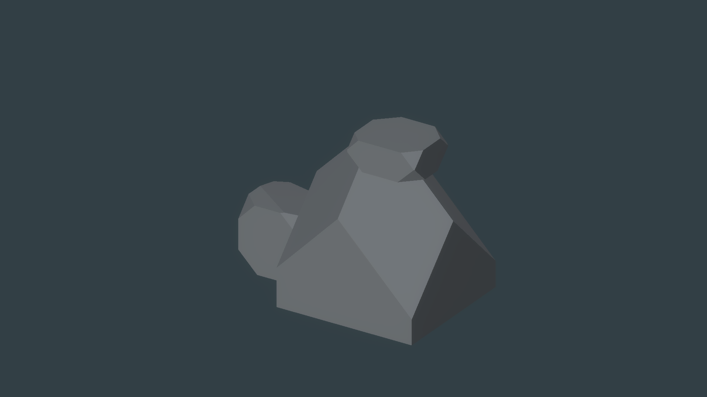
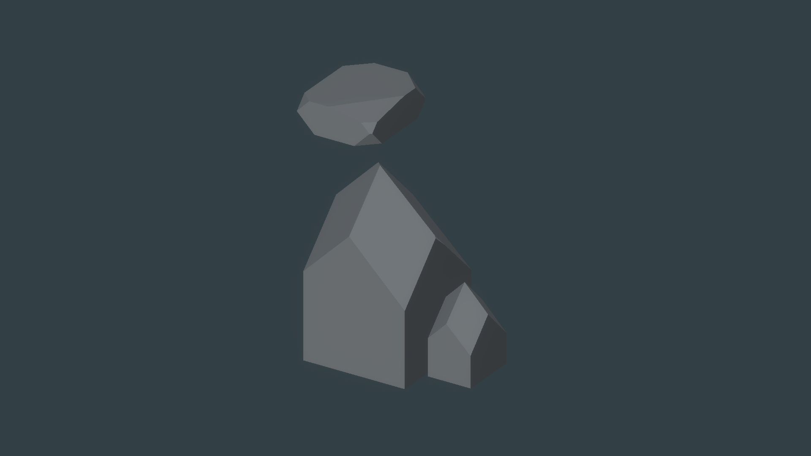

# U4C source geometry → matter fidelity

**Disposition: `SOURCE_MODELER_HOLD`, September 27, 2026.** Gate A did not pass after the one focused source-modeler remediation allowed by the implementation brief. No source mesh was voxelized. Stop for owner review; do not begin U4D, U5, Unreal, adaptive terrain stitching, or production migration.

## Direct source result

The implementation replaces the first single-polyhedron pass with three deterministic `BeveledCompositeHalfSpaceRock-v2` source recipes. Each recipe combines three bevel-cut closed components into one direct mesh, using a narrow source-space gap to show a cap, shoulder, shelf, or buttress relationship. These meshes remain generation input only. Their components are not yet matter, runtime ownership, or persistence authority.

The repair materially improves on U4B's soft fused-clast read and exposes broad planar faces, bevel cuts, asymmetry, and component hierarchy. The independent reviewer still found the full source set short of `ROCK_FORMATION_TARGET.md`: A remains a regular slab/wedge; B's central silhouette reads like an architectural block; C's upper cap appears disconnected or floating and its central mass remains house-like. The bevels read as hard cuts instead of convincing rounded/beveled rock corners. The target requires a compact, coherent, interlocking stylized rock formation. The single allowed remediation is exhausted, so the source gate remains HOLD.

## Captures

All nine captures show the direct source mesh at matched physical scale, camera convention, lighting, and neutral stylized surface. Each has a beauty, second-angle, and wireframe image. The metrics sidecars report the recipe version, component/plane/face/vertex/triangle counts, bounds, closed-manifold result, and deterministic geometry hash. `source-rock-recipes.json` stores each component's offset and full normalized half-space plane list.

| Source | Beauty | Alternate angle | Wireframe | Components / faces / vertices / triangles | Closed manifold | Hash |
| --- | --- | --- | --- | ---: | --- | --- |
| A — Capstone Slab | [PNG](source-rock-A-beauty.png) | [PNG](source-rock-A-angle2.png) | [PNG](source-rock-A-wireframe.png) | 3 / 41 / 70 / 128 | yes | `7AE85680723BEA01` |
| B — Chunky Boulder | [PNG](source-rock-B-beauty.png) | [PNG](source-rock-B-angle2.png) | [PNG](source-rock-B-wireframe.png) | 3 / 39 / 66 / 120 | yes | `16134C9948FA5D86` |
| C — Buttress Wedge | [PNG](source-rock-C-beauty.png) | [PNG](source-rock-C-angle2.png) | [PNG](source-rock-C-wireframe.png) | 3 / 34 / 56 / 100 | yes | `0377081DE4DB2D7D` |







## Independent visual review

**Final Gate A verdict: HOLD — `SOURCE_MODELER_HOLD`.** The reviewer confirmed clean, readable wireframes and closed shells without visible holes, spikes, winding defects, or broken triangulation. A is the strongest result but remains a regular slab; B remains an architectural block; C's capstone and lower secondary stone appear separated from the central wedge. The set is visibly better than U4B's soft fused clasts, but does not yet read as three plausible stylized game-rock assets or substantially meet the target. No further repair pass was made.

## Validation and limits

- Unity recompile: completed, 0 compile errors.
- Focused `ProceduralSourceRockTests`: 3/3 passed.
- All three fixed-seed source meshes: deterministic hashes, 3 closed components each, outward-wound face triangles, finite bounded geometry.
- Unity console at checkpoint: 0 current errors and 5 warnings; the warnings are existing project warnings, not introduced by the source-rock code.
- Full EditMode/PlayMode suites and Windows Development Build: not run because the explicit source gate stopped U4C before matter conversion.
- True SDF sampling, occupancy/clipped control, all four resolution comparisons, fidelity metrics, field-memory/timing, and Surface Nets reconstruction: **not started**.
- U4/U4B, U2 matter authority, Surface Nets default, and 0.50 m baseline were not changed. This HOLD does not establish a Unity engine limitation.

## Reproduction

With the Unity 6.3 project open and connected to the existing Unity MCP/Pipeline bridge:

```text
mcp__unity__eval:
  return Wildkin.AgentTools.Editor.SourceRockAgentCommands.CaptureSourceRockSet();

mcp__unity__run_tests:
  mode=editor, filter=ProceduralSourceRockTests, filter_type=testName
```

These commands regenerate the direct-source image set, component recipes/metrics, and focused geometry test result. They do not voxelize the source.

The machine-readable summary is [receipt.json](receipt.json). The source-gate decision and next-stage boundary are also recorded in [CURRENT_SLICE](../../../../docs/CURRENT_SLICE.md), [SESSION_START](../../../../docs/SESSION_START.md), the [Unity-first plan](../../../../docs/UNITY_FIRST_TRANSITION_PLAN.md), and the [source geometry plan](../../../../docs/SOURCE_GEOMETRY_MATTER_FIDELITY_PLAN.md).
