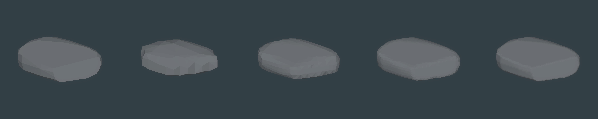
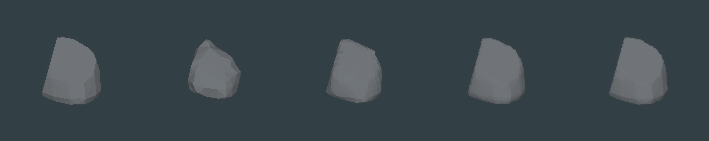
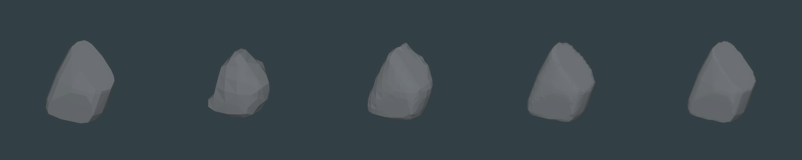

# U4C2 — sculpted source stones and matter fidelity

**Final disposition: `REPRESENTATION_HOLD`. Source Gate A: PASS after one bounded repair.** September 28, 2026; Unity 6000.3.25f1 / HDRP 17.3.0, Windows PC qualification. Stop for owner review after the authorized main commit/push. This does not admit U4D, U4E, U5, Unreal, adaptive terrain stitching, destruction or production migration.

The source modeling problem is solved for the three reviewed fixed stones. The representation experiment reaches the complete matrix, but two fine reconstructions have a nonmanifold edge. The lowest common visual/topology baseline is **0.25 m**. That is a bounded reviewer finding for this source set, not an owner-selected production spacing. The ordinary MatterWorld default remains 0.50 m.

## Source method and history

The failed [old U4C composite half-space method](../u4c-source-matter-fidelity/README.md) remains untouched as negative evidence. The new modeler welds a moderately subdivided cube shell, projects it onto an anisotropic superquadric, applies lean/taper/skew/twist and broad quadrant asymmetry, shapes a contact base, then makes three large subtractive face cuts through the same shell. The cuts produce shared boundary caps; they do not attach pieces. There is no noise-per-vertex, metaball blend, convex-piece assembly, new package, or general decimator.

Initial superquadric captures were HOLD: A was capsule-like, B a softened block, C a leaning tombstone. [Initial review](review-initial.md) and all nine images/recipes remain in `initial/`. The one permitted art adjustment added large unequal cut planes. A numerical near-vertex clearance prevents clipping slivers without another art pass. The [independent final review](review-final.md) passes the actual final nine captures and pins their hashes.

| Stone | Seed | Source vertices / triangles | Hash | Captures |
| --- | ---: | ---: | --- | --- |
| A — Capstone Slab | 4101 | 129 / 254 | `881447DF8B9C5082` | [Beauty](stone-A-beauty.png), [second angle](stone-A-angle2.png), [wireframe](stone-A-wireframe.png), [recipe/metrics](stone-A-metrics.json) |
| B — Chunky Boulder | 4102 | 126 / 248 | `EA991B6C6C2D132D` | [Beauty](stone-B-beauty.png), [second angle](stone-B-angle2.png), [wireframe](stone-B-wireframe.png), [recipe/metrics](stone-B-metrics.json) |
| C — Buttress Wedge | 4103 | 127 / 250 | `EF8ACF6528F0C296` | [Beauty](stone-C-beauty.png), [second angle](stone-C-angle2.png), [wireframe](stone-C-wireframe.png), [recipe/metrics](stone-C-metrics.json) |

Each stone has one connected, finite, outward-wound genus-zero shell and nonzero volume. The recipe/triangle arrays are generation input only. Separate-stone formation composition belongs to U4E.

## Matched source → Surface Nets comparisons

Every strip uses the exact admitted source hash at the same camera, physical scale, neutral shader and lighting. Columns run **SOURCE | 0.50 m | 0.25 m | 0.125 m | 0.0625 m**. The strips assemble identical centered crops of actual native captures; no generated or retouched geometry is shown.







Second-angle strips: [A](resolution-A-angle2.png), [B](resolution-B-angle2.png), [C](resolution-C-angle2.png). Individual `matter-*-beauty.png` / `angle2.png` captures remain available beside the strips. B closeups are recorded for [0.125 true SDF](matter-B-0.125-sdf-closeup.png), [0.0625 true SDF](matter-B-0.0625-sdf-closeup.png), and [0.125 clipped control](matter-B-0.125-clipped-closeup.png).

## Scalar representation and errors

`SourceMeshSignedDistance` computes the nearest triangle face/edge/vertex distance. Deterministic ray parity supplies the sign, with solid-angle winding for ambiguous edge/vertex hits. Positive density means Rock; zero/negative density means Air. The dense local field retains exact signed values inside its padded bounds. Fixed negative air is returned only outside that window, where the surface is already separated by padding. This is not a sparse production MatterDomain and it does not fill the global world with air overrides.

The matched B/0.125 control retains positive interior distances but replaces exterior distances with fixed `-spacing` air; occupancy, bounds and sample count are identical. [True SDF](matter-B-0.125-sdf-beauty.png) is visibly more faithful than [the control](matter-B-0.125-clipped-beauty.png). Metrics in the generated table below quantify both directions. Reconstructed→source error samples every retained reconstructed vertex. Source→field error samples source vertices plus deterministic triangle centroids and edge midpoints, using trilinear field reads. These are diagnostic distances, not a full Hausdorff or perceptual guarantee.

## Topology finding and decision

| Spacing | A | B | C | Review |
| --- | --- | --- | --- | --- |
| 0.50 m | manifold | manifold | manifold | Loses too much source cut/plane character |
| 0.25 m | manifold | manifold | manifold | Lowest common acceptable visual/topology baseline |
| 0.125 m | manifold | manifold | **one 4-use edge** | Improved fidelity, fine-tier HOLD |
| 0.0625 m | manifold | **one 4-use edge** | manifold | Strongest fidelity, fine-tier HOLD |

All rows skip zero degenerate triangles. The C/0.125 edge runs from `(0.1756221, 1.069546, -0.7523146)` to `(0.1756221, 1.069546, -0.7481436)`. The same failures survive replacing positional welding with the mesher's integer vertex-cell identities. This rules out aggregate weld precision as their cause and is consistent with the unchanged one-vertex-per-cell Surface Nets face ambiguity. The exact failure is tested and disclosed; passing regression tests does not turn those two meshes into valid representations.

The [independent fidelity review](fidelity-review.md) finds adequate broad-face/corner fidelity by 0.25 m and better fidelity in finer tiers. The requested condition for `REOPEN_MESHER`—persistent important feature loss despite good source, verified SDF and fine spacing—is therefore not met. **Recommendation: REPRESENTATION_HOLD** until a fresh bounded topology qualification addresses the two fine-tier failures or the owner reviews a narrower representation envelope. No Dual Contouring comparison was reopened.

## Cost and validation

The tables below are one measured Editor run per row, not warmed medians or world-scale/update benchmarks. Density/material memory is exactly five raw bytes per sample; managed overhead, peak working set and allocation totals are unavailable. Surface Nets time includes bounded region snapshots and region integration; publication time is stored separately in each JSON sidecar. Temporary halo snapshots and mesher arrays add memory beyond the raw local field payload.

Final proof is summarized by [receipt.json](receipt.json): source tests 16/16; scalar/fidelity/adapter tests 23/23; full EditMode 124/124; PlayMode 2/2. The adapter parity test covers all six world fixtures, positive/negative bricks, both existing meshers, integer-cell metadata and prohibited world writeback. World ownership, material selection, source winding/hashes and transient source/matter renderer replacement are checked; physics and persistence are outside this experiment.

Windows x64 Development build: [provenance](build-provenance.json), [detached job result](build-job.json). The earlier synchronous build exceeded the bridge's dispatcher timeout; detached jobs provide the correct longer-lived transport. The initial player exposed shader stripping, corrected by explicit serialized source/matter presentation shader references. [Final player capture](player-B-0.125.png), [player field/mesh receipt](player-B-0.125.json), [launch result](player-launch.json) and `player.log` prove actual standalone reconstruction. Player timing is one cold development-player run, reported separately from Editor timing. Unity reports eight persistent allocations during shutdown; their origin is unassigned, so this checkpoint does not claim a leak-free runtime. The player presents B at 0.125 m, a valid individual matrix row; it does not prove that every fine tier is valid.

## Reproduce and review as a human

Open the Unity project at `native/unity/WildkinUnity/` with Unity 6000.3.25f1. In the Tech scene **U4C2SculptedSource**, entering Play shows the chunky boulder rebuilt from its 0.125 m local matter field. It should be one grounded gray stone with an uneven cut crown and broad faces. Missing/pink geometry, a blank view, spikes or disconnected caps are visible failures. This scene is a geometry qualification viewer, without gameplay controls.

For image review, open each source beauty and second-angle pair, then its wireframe. A should read as a substantial broad slab, B as an uneven chunky boulder, C as a raked buttress. Each must remain one connected stone with readable large/medium faces and softened corner transitions. Open each resolution strip and compare the same landmark cut and silhouette from left to right. 0.50 should lose shape definition; 0.25 should retain the authored shape; finer columns should improve it. The two fine topology defects may be too small to see: their machine topology flags remain authoritative regardless of a clean-looking screenshot. Compare B's two 0.125 closeups: the true-SDF silhouette should follow the source more closely than the fixed-air control.

CLI/Pipeline commands (run from the Unity project directory; all invocations use `--caller plugin --skill unity-cli`):

```text
unity command capture_sculpted_stone_set --caller plugin --skill unity-cli
unity command capture_stone_fidelity --label A --spacing 0.125 --caller plugin --skill unity-cli
unity command capture_stone_fidelity --label B --spacing 0.125 --clipped true --caller plugin --skill unity-cli
unity command capture_stone_fidelity_strips --caller plugin --skill unity-cli
unity command run_tests --mode editor --caller plugin --skill unity-cli
unity command run_tests --mode playmode --async_tests true --caller plugin --skill unity-cli
unity command test_status --caller plugin --skill unity-cli
unity command u4c2_build_windows_development --detach --caller plugin --skill unity-cli
unity job wait <returned-job-id>
```

The capture-set command writes the top-level final source evidence; use another work copy/folder if testing a new artistic candidate. The original failed U4C folder is never its target. Matrix capture commands only reconstruct an accepted fixed source and overwrite their own matched matrix row. Run all four spacings for A/B/C before assembling strips. After capturing, source-set presentation restores a source scene; the build command instead saves the valid B/0.125 matter preview for its player checkpoint.

## Known limits

Source acceptance covers three fixed seeds, with bounded deterministic topology tests on alternate seeds; it is not a production art-family certification. The generator is low-poly source modeling with bounded controls and no generic self-intersection admission system. Sampling is brute-force CPU work proportional to samples × triangles. Timings do not demonstrate edit latency, infinite-world streaming, physics, actor extraction, persistence, support/contact or memory residency policy. No formation was composed, no matter was mined, and no browser code was changed. The topology blocker needs owner review and fresh scoped work before advancing.

## Measured matrix

| Stone / field | Spacing m | Samples / occupied | Raw bytes | Mesh vertices / triangles | Source / SDF / mesh / publish ms | Manifold |
| --- | ---: | ---: | ---: | ---: | --- | --- |
| A / SDF | 0.0625 | 77220 / 28007 | 386100 | 7156 / 14308 | 1.61 / 6912.63 / 937.27 / 6.10 | True |
| A / SDF | 0.125 | 14976 / 3415 | 74880 | 1768 / 3532 | 1.51 / 1382.67 / 185.23 / 1.74 | True |
| A / SDF | 0.25 | 3696 / 405 | 18480 | 428 / 852 | 1.34 / 359.74 / 147.16 / 1.09 | True |
| A / SDF | 0.5 | 1232 / 50 | 6160 | 112 / 220 | 21.89 / 130.87 / 154.41 / 15.45 | True |
| B / SDF | 0.0625 | 66880 / 22155 | 334400 | 5943 / 11884 | 1.75 / 5964.37 / 961.81 / 5.55 | False |
| B / clipped | 0.125 | 12650 / 2718 | 63250 | 1458 / 2912 | 1.16 / 1194.24 / 189.02 / 1.37 | True |
| B / SDF | 0.125 | 12650 / 2718 | 63250 | 1458 / 2912 | 1.12 / 1156.76 / 226.34 / 1.34 | True |
| B / SDF | 0.25 | 3136 / 323 | 15680 | 352 / 700 | 1.11 / 261.76 / 120.07 / 0.79 | True |
| B / SDF | 0.5 | 1100 / 36 | 5500 | 84 / 164 | 1.59 / 103.59 / 159.49 / 3.16 | True |
| C / SDF | 0.0625 | 67860 / 18830 | 339300 | 5632 / 11260 | 1.32 / 6015.58 / 490.77 / 4.49 | True |
| C / SDF | 0.125 | 13050 / 2332 | 65250 | 1393 / 2784 | 8.60 / 1381.56 / 333.77 / 1.61 | False |
| C / SDF | 0.25 | 3060 / 280 | 15300 | 332 / 660 | 1.51 / 273.06 / 127.85 / 0.77 | True |
| C / SDF | 0.5 | 1089 / 39 | 5445 | 86 / 168 | 1.27 / 102.60 / 136.74 / 0.57 | True |

| Stone / field | Spacing m | Reconstruction → source median / p95 / max m | Source → field median / p95 / max m |
| --- | ---: | --- | --- |
| A / SDF | 0.0625 | 0.000000 / 0.006098 / 0.025448 | 0.000047 / 0.012683 / 0.019937 |
| A / SDF | 0.125 | 0.000056 / 0.018100 / 0.049171 | 0.000992 / 0.027443 / 0.042798 |
| A / SDF | 0.25 | 0.004707 / 0.056088 / 0.102641 | 0.009267 / 0.054665 / 0.080501 |
| A / SDF | 0.5 | 0.027822 / 0.172178 / 0.232916 | 0.048435 / 0.117918 / 0.171677 |
| B / SDF | 0.0625 | 0.000000 / 0.005387 / 0.024340 | 0.000060 / 0.014037 / 0.020668 |
| B / clipped | 0.125 | 0.024501 / 0.062500 / 0.079219 | 0.059143 / 0.125000 / 0.125000 |
| B / SDF | 0.125 | 0.000008 / 0.020190 / 0.048249 | 0.001357 / 0.030241 / 0.043605 |
| B / SDF | 0.25 | 0.004371 / 0.058270 / 0.093651 | 0.009271 / 0.061331 / 0.090091 |
| B / SDF | 0.5 | 0.033072 / 0.188057 / 0.222301 | 0.045413 / 0.139507 / 0.194018 |
| C / SDF | 0.0625 | 0.000000 / 0.005870 / 0.025000 | 0.000139 / 0.014291 / 0.023419 |
| C / SDF | 0.125 | 0.000172 / 0.016769 / 0.052271 | 0.001913 / 0.030510 / 0.048176 |
| C / SDF | 0.25 | 0.005946 / 0.056504 / 0.112823 | 0.010684 / 0.066047 / 0.110800 |
| C / SDF | 0.5 | 0.036092 / 0.128633 / 0.209093 | 0.045054 / 0.139775 / 0.170154 |
