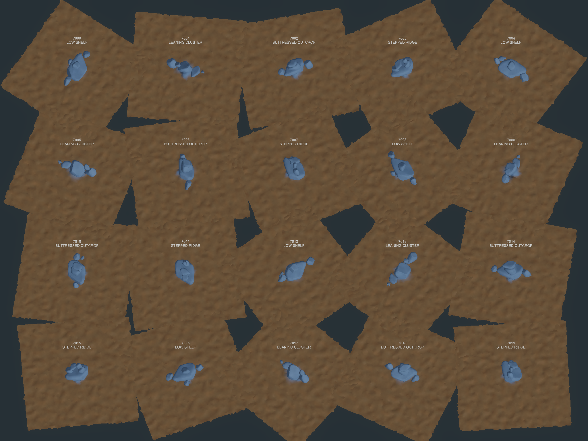
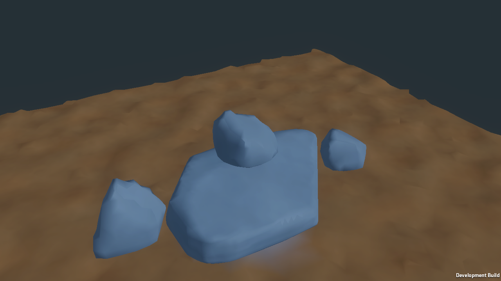

# U4E — procedural multi-domain rock formations

**Disposition: HOLD after independent visual review, September 28, 2026.** U4E's deterministic generation, separate MatterDomain authorities, measured contact graph, sampled-overlap diagnostics, local edit isolation, pristine regeneration, automated tests and Windows Player gates pass. The visual formation target remains unmet after one bounded camera/framing repair: several stones still read as separated or floating. U5 was not started.

## Technical result

- The deterministic 20-seed gallery accepts all 20 final formations across four families (five per family). Eight seeds needed retries: seven accepted on attempt index 1 and one on index 2; there are no rejected final gallery seeds.
- The gallery contains 19 five-domain formations and one six-domain formation. Each has exactly one 0.125 m child and four or five independent 0.25 m children. All 101 child source-geometry hashes are unique.
- Geometry-derived contacts include 35 cross-tier edges. Fitted gap observations range from −6.65 mm to +34.43 mm. The separate bidirectional sampled-overlap check reports zero overlapping pairs among all 306 possible terrain/sibling pairs. All accepted graph components connect to terrain.
- Fixed contact configuration in `U4EFormationConfiguration`: 25 mm target gap, 60 mm maximum gap, 12.5 mm maximum surface penetration, at least two near-contact witnesses, 1 mm pose quantization, up to 3.25 m fitting adjustment/eight fitting iterations, and five candidate attempts. Thresholds are fixed across seeds.
- Seed 7000's 0.125 m foundation edit changes 67 samples out of 648 examined; two regions are directly affected, two are rebuilt, and 14 are reused. Only its five incident terrain/sibling contact pairs are invalidated. The terrain revision/edit count and all four sibling content/mesh hashes stay unchanged.
- A 364-byte pristine recipe descriptor regenerates the same formation, graph, child IDs, child matter, mesh and source-geometry hashes. The represented raw matter payload is 99,480 bytes; the descriptor is below the 10% target. Source geometry is discarded after bake.
- The U4C3 topology limitation carries forward: evidence covers the recorded genus-zero source family and face-topology path; arbitrary trilinear interior connectivity and higher-genus surfaces are not qualified.

## Validation and Player

- Focused U4E EditMode: 3/3 passed.
- Full EditMode: 156/156 passed in 183.29 seconds.
- PlayMode: 3/3 passed, including U4E runtime generation and pristine regeneration.
- Unity 6000.3.25f1 Windows x64 Development Player: build succeeded in 33.06 seconds, 230,387,193 bytes, zero errors/five warnings; standalone process exited 0 and wrote the Player capture and runtime receipt. Recorded seed-7000 Player timings are in `player/receipt.json`; they are one run, not a performance benchmark.

See [test records](tests/), [build provenance](player/build-provenance.json), [runtime receipt](player/receipt.json), [edit/regeneration metrics](metrics/), and [independent review](review.md).

## Visual disposition

The gallery aggregate hash for seed 7000 includes that formation's deterministic gallery-tile pose and contact context. The origin Player and pristine-regeneration receipts use the origin pose and match each other (`0x0F88FA53FA2DB385`); child source/content/mesh hashes match across these records. The aggregate hash is pose/contact-context-sensitive by design.

The first independent review found that the gallery and Player overview were framed too far away to judge the stones. One bounded presentation repair widened the gallery tiles and reframed the gallery, heroes and Player capture; the geometry/contact recipe was unchanged. The second review confirms that framing is now readable, but still sees visibly separated/floating pieces in several hero formations. The contact graph is geometric evidence and does not prove a convincing visual interlock. Review identifies seeds 7004, 7017, 7010, 7015 and weakest seed 7019. The allowed visual repair is exhausted; keep U4E at HOLD pending owner review.

## Evidence index

- `captures/gallery-20.png`, `captures/heroes/`, `captures/alternate/`, `captures/weakest/` — final gallery, hero, alternate-angle and weakest-seed views.
- `captures/domain-boundaries.png`, `captures/contact-graph.png`, `contact/` — independent domains and geometry-derived contact diagnostics.
- `captures/edit-before.png`, `captures/edit-after.png`, `captures/regenerated.png`, `metrics/edit.json`, `metrics/persistence.json`, `persistence/` — local edit and pristine reconstruction.
- `player/` — Windows build provenance, standalone capture and runtime metrics.
- `receipt.json` — gallery/technical candidate summary. Overall independent disposition is HOLD as detailed above and in `review.md`.
- `working-tree-before-staging.md` — unrelated local changes deliberately preserved outside the U4E commit.
